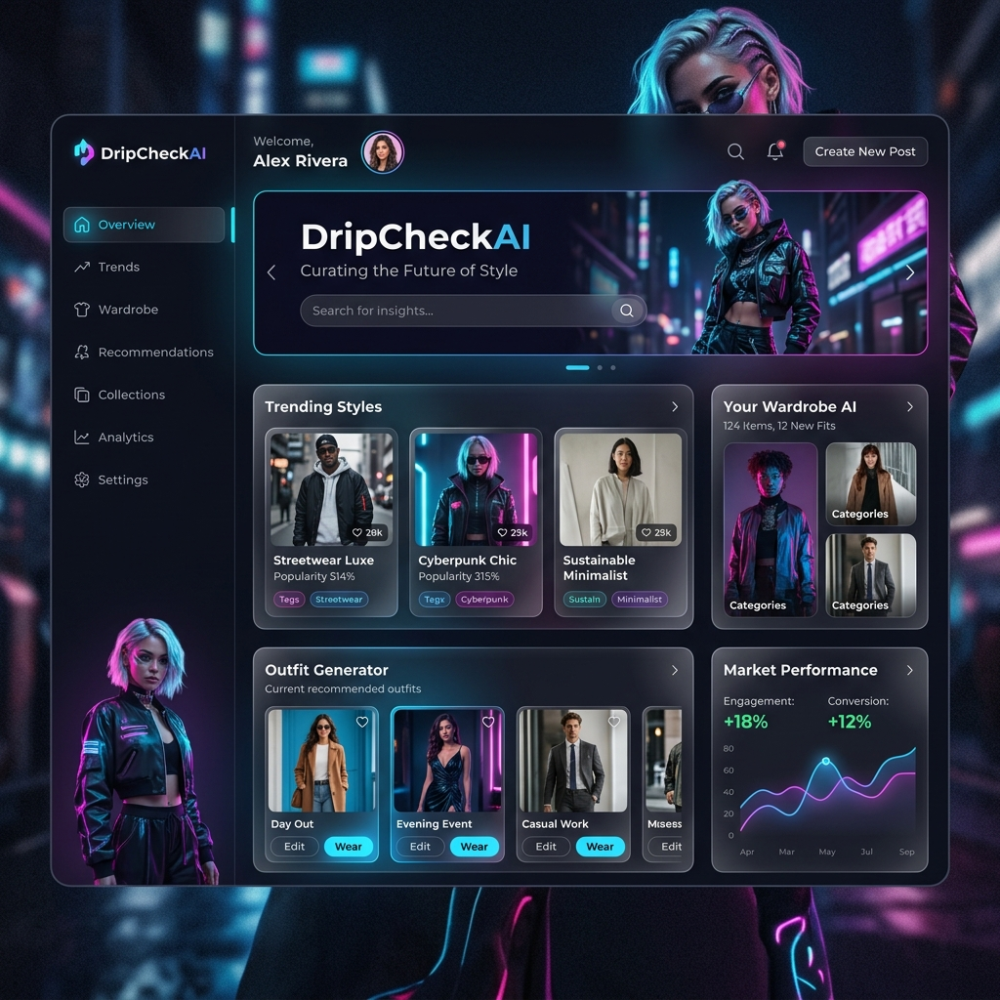

<div align="center">
  
  
  # 🕶️ DripCheckAI
  **Your Personal AI Fashion Consultant & Wardrobe Analyst**
  
  <p>
    
    
    
    
    
    
  </p>
</div>

---

## 🌟 Overview

**DripCheckAI** is a premium, full-stack AI styling application that acts as your personal fashion coach. Powered by **Google Gemini 2.5 Flash**, the application leverages advanced computer vision to analyze your outfit uploads, break down garment details, assess color harmony, and assign you a definitive "Drip Score". 

Designed with a sleek, futuristic **Glassmorphism B2B Dashboard** aesthetic, DripCheckAI provides high-fidelity feedback to help you elevate your personal style.

---

## ✨ Features

- 📸 **Computer Vision Upload Pipeline:** Drag-and-drop your outfit photos for instant processing.
- 🧠 **Gemini AI Analysis:** Deep neural network evaluation of your fashion choices.
- 🎯 **Garment Detection:** Automatically identifies and categorizes the clothing items you're wearing.
- 🎨 **Color Harmony Analysis:** Assesses your outfit's color palette and styling cohesion.
- 📊 **Dynamic Drip Score:** Get a quantifiable rating on your outfit's impact.
- 🕒 **Historical Wardrobe Dashboard:** Securely save and review your past outfits using MongoDB.
- 💎 **Premium UI/UX:** Built with Radix UI, Framer Motion animations, and custom Tailwind CSS glass-panels.

---

## 🚀 Live Demo

The application is fully deployed and accessible on Vercel:
👉 **[View DripCheckAI Live](https://outfit-code-correct-main.vercel.app/)**

*(Ensure your backend is running or deployed correctly to utilize the AI features).*

---

## 💻 Tech Stack

### Frontend
* **Framework:** React 18 & Vite
* **Styling:** Tailwind CSS & Shadcn/Radix UI
* **Animations:** Framer Motion
* **Routing:** React Router DOM
* **Icons:** Lucide React

### Backend
* **Server:** Node.js & Express.js
* **Database:** MongoDB Atlas (Mongoose ODM)
* **AI Integration:** `@google/genai` (Gemini 2.5 Flash)
* **Deployment:** Vercel (Serverless Functions)

---

## 🛠️ Local Installation & Setup

Want to run DripCheckAI locally? Follow these steps:

### 1. Clone the repository
```bash
git clone https://github.com/ShubhiGoel5/DripCheckAI.git
cd DripCheckAI
```

### 2. Install Dependencies
Install both the frontend and backend dependencies.
```bash
# Install frontend dependencies
npm install

# Install backend dependencies
cd backend
npm install
cd ..
```

### 3. Environment Variables
Create a `.env` file in the `backend/` directory and add the following keys:
```env
# backend/.env
PORT=5000
MONGO_URI=mongodb://127.0.0.1:27017/dripcheck  # Or your MongoDB Atlas URI
GEMINI_API_KEY=your_gemini_api_key_here
```

### 4. Run the Application
You will need two terminal windows to run both servers concurrently.

**Terminal 1 (Backend):**
```bash
cd backend
npm start
```

**Terminal 2 (Frontend):**
```bash
npm run dev
```

Visit `http://localhost:5174` in your browser to see the app running!

---

## 🤝 Contributing

Contributions, issues, and feature requests are welcome! 
Feel free to check the [issues page](https://github.com/ShubhiGoel5/DripCheckAI/issues) if you want to contribute.

1. Fork the Project
2. Create your Feature Branch (`git checkout -b feature/AmazingFeature`)
3. Commit your Changes (`git commit -m 'Add some AmazingFeature'`)
4. Push to the Branch (`git push origin feature/AmazingFeature`)
5. Open a Pull Request

---

<div align="center">
  <p>Built with ❤️ and AI.</p>
</div>
